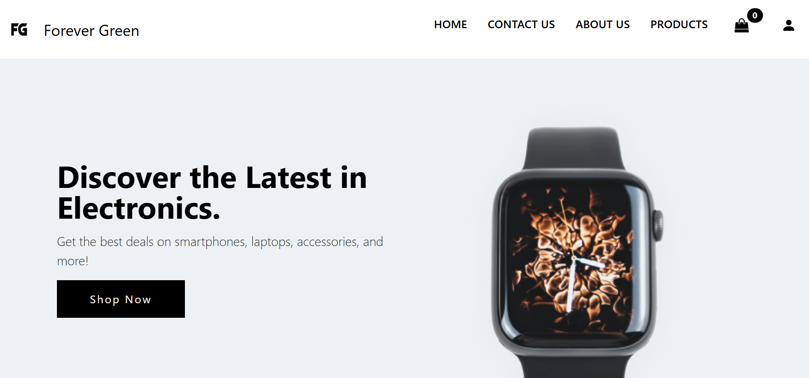
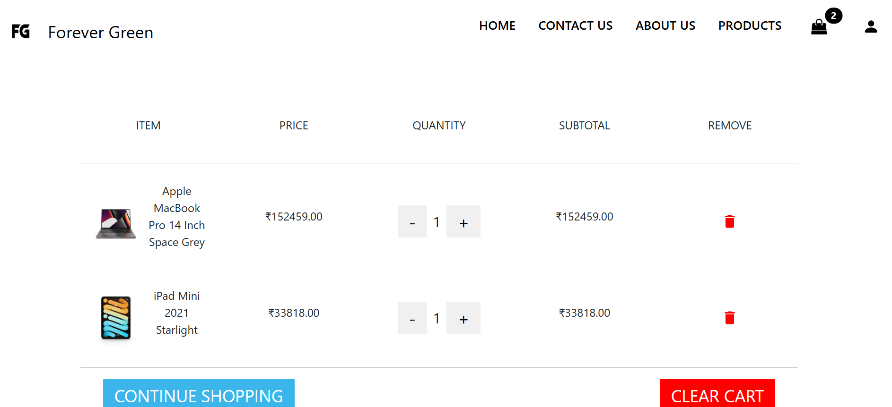
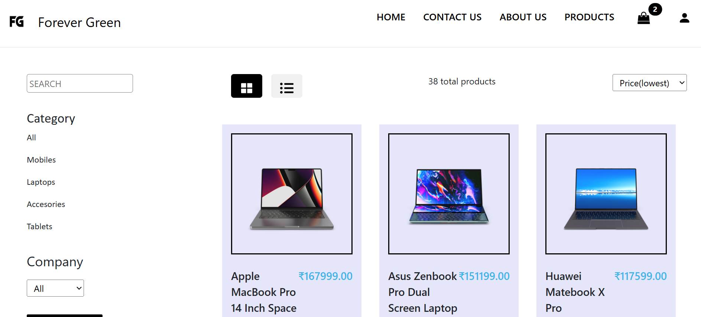

# E-Commerce Electronics Website

This project is a React-based e-commerce platform designed to showcase electronic products such as laptops, mobiles, tablets and accessories. The website offers a dynamic and user-friendly interface with features like product filtering, sorting, and responsive views, providing a seamless shopping experience. It also includes static pages for login, signup, and contact forms, though user authentication is not yet implemented.

## Features

**Product Listing** : Displays products with options to filter by category, company and search by name.  
**Sorting Options** : Sort products by price (lowest to highest, highest to lowest) or alphabetically (a to z or z to a). 
**View Options** : Toggle between grid and list view for product display. 
**Static Pages**: Includes static login/signup page.

## Website Images

  
  
 
